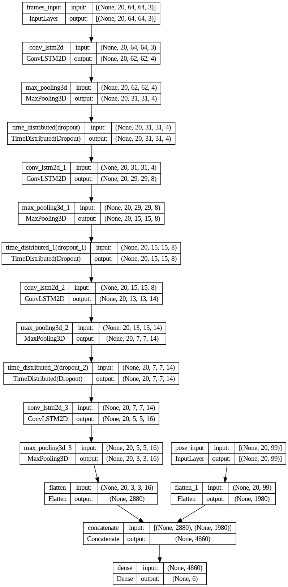
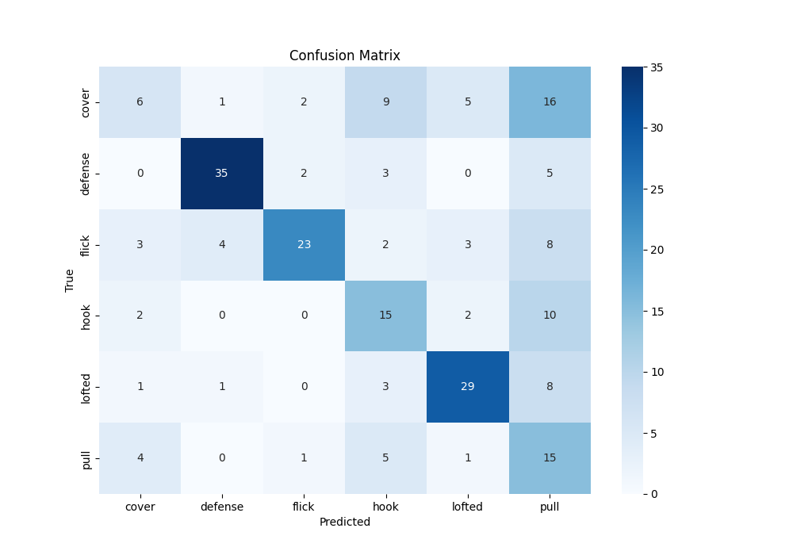

# AI-Based Cricket Shot Classification Using ConvLSTM and Pose Estimation

This repository contains the implementation of a machine learning model designed to classify cricket shots using ConvLSTM and pose estimation techniques. The model leverages both frame and pose features to enhance the accuracy of the classification task.

## Table of Contents

- [Introduction](#introduction)
- [Model Architecture](#model-architecture)
- [Results](#results)
  - [Confusion Matrix](#confusion-matrix)
  - [Accuracy and Loss Graphs](#accuracy-and-loss-graphs)
- [Pros and Cons](#pros-and-cons)
- [Possible Future Work](#possible-future-work)
- [How to Use](#how-to-use)
- [Dependencies](#dependencies)
- [License](#license)

## Introduction

Cricket is a sport rich in variety, with numerous types of shots that players can perform. This project aims to automatically classify different cricket shots using video data. The model is built using a combination of Convolutional LSTM (ConvLSTM) networks and pose estimation, enabling the extraction of both spatial and temporal features from the video frames.

## Model Architecture

The model architecture includes:
- **ConvLSTM2D layers**: For capturing spatiotemporal dependencies.
- **Pose Estimation**: Used alongside frame features to enhance classification accuracy.
- **Dense Layers**: To finalize the prediction based on combined features.

## Results

### Confusion Matrix

The following confusion matrix shows the performance of the model across different cricket shots:

### Accuracy and Loss Graphs

The graphs below illustrate the training and validation accuracy and loss over the epochs:

- **Total Accuracy vs Total Validation Accuracy**
  
  

- **Total Loss vs Total Validation Loss**
  
  

## Pros and Cons

### Pros
- **Spatiotemporal Feature Extraction**: The use of ConvLSTM enables effective capture of both spatial and temporal features in video sequences.
- **Pose Integration**: Enhances the model’s ability to classify shots by using pose information.
- **Generalizable**: The architecture can be adapted for other sports or activities involving complex motions.

### Cons
- **Computationally Intensive**: Training requires significant computational resources, especially for larger datasets.
- **Overfitting**: The model shows a potential to overfit, as evidenced by the divergence between training and validation accuracy/loss.

## Possible Future Work
- **Data Augmentation**: Implementing data augmentation techniques to reduce overfitting.
- **Transfer Learning**: Exploring pre-trained models to reduce training time and improve accuracy.
- **Real-Time Inference**: Optimizing the model for real-time inference on low-power devices.

## How to Use

1. **Clone the repository**:
   git clone https://github.com/MaroofAshraf/ConvLSTM-Cricket-Shot-Classifier.git
